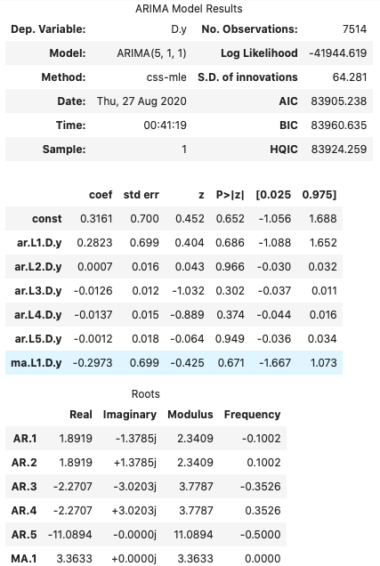

# **CONCLUSIONS/ SUMMARY**
Here I employed two types of analysis to predict future prices of Yen. I first used ***Time Series Analysis*** to determine whether there is any predictable behavior in the Dollar-Yen exchange rate. I then used ***Line Regression Analysis*** to predict the futures settle prices/returns on yen. Here I will discuss my findings in a ***Time Series Analysis*** section and a ***Line Regression Analysis*** section. I will then combine my views in a subsequent conclusion. 

---------------------------------------------------------------

## **Time Series Findings**
From an initial plotting of the settle prices. I noticed an upward trend. 

One can see that between 1990 and the more current data, while there are dips as a whole the data is moving upward. This is promising one would think that if one buys as, eventually they will see a positive return. You still would want the best entry though to be smart about it. 

I then decomposed the data with a Hodrick Prescott filter so I could see the specific noise and the specific trend. I took the trend data and overlaid it on the chart above. I then created the chart below. 

Here I used data between 2015-2019 to make things closer to current times. The orange line is a representation of pure trend. One can see that it is a smooth line because all of the level and noise is gone. We can still see that it has a huge impact on this plot because it is almost constant with the settle line. One can see how everything is moving upward as well. 

Below, one can see the pure noise data. The interesting thing is that the noise is actually somewhat staying in a general area. Like our noise has a pattern or trend in itself, this is good, it means that we have stationary data. This becomes handy in the creation of models. 

After doing these plots I began forecasting with ARMA and ARIMA models. In both models my p values ended up being greater than 0.05 which pretty much told me that my models were not great. 

Below one can find my ARMA summary. 

One can see that my p values were quite large. 

I then used my ARMA to create a 5 day forecast which can be found below. 

While the forecast gives positive returns one can see that there is a huge decline. This creates hesitation for me.

Here one can find the results of my ARIMA.

Again one can see that all of my p values were greater than 0.05.

Like the ARMA, I then created a 5 day forecast. 

Here one can see that there are projected increases in the returns.

I then wanted to analyze volatility. Volatility begets volatility and there is a belief that volatility and returns cluster together. If one can be on the right side of volatility he/she could come into big returns. I believe that this idea can really be seen in this data as well. To analyze the volatility I used a GARCH model.

Below one can see the results of my GARCH model. 

I then did a five day forecast for the data as well, found below.

The volatility is constantly increasing. It is projected to keep going straight up. 

### **Conclusion**
-  ***Should I buy?***
    -  In my ARMA model, one can see that the 5 day forecast has a huge decline, but at the same time while the return amounts decrease, each day still has positive returns. We can then look at the ARIMA and find positive settle prices daily as well and increasing at that. When we then look at the GARCH forecast, the volatility is predicted to go straight up. My plot illustrates a completely positive slope. This could go with the cluster idea, that when volatility occurs, returns react at the same time. With high volatility and the fact that my ARMA is giving me declining returns, regardless I would be hesitant to buy the yen. I would need more information, look at my risk to reward. I would also begin to look at other factors like the timing of my buy. This could be the top of a drop. Volatility is high and the forecast is looking like declining returns. At this point I would go into the live ticker to make my final decisions. I would be very interested though because again, even when we first looked at the data one could see that the raw settle data had a solid positive trend and our noise was seemingly stationary. This means the trend was the biggest factor in the raw data itself, and even if the return amounts declined the ARMA still forecasted positive returns and the ARIMA has positive settle prices. I believe the fact that the raw data was seemingly stationary could skew the ARIMA as well because we gave an argument of a difference of 1. The difference may have not been needed which may skew the data more. This could cause error. Maybe I would first look at the maximum profit I could make analyzing the best day to close from my forecast data. Then again analyze my risk to reward. I also have to add that the P values for both my ARMA and ARIMA were above 0.05 so we have to be weary of the data regardless.

-  ***Risk Analysis***

    -  As stated above the risk of the yen is expected to sky rocket. My GARCH forecast has a straight positive sloped line. Each day the volatility increases.

-  ***Would I trade these?***

    -  I definetely feel like these are an awesome tool to have in my toolkit. Would I completely rely on them? No. I believe in technical analysis and sentimental analysis with some sprinkles of fundamental analysis. I am learning these algorithms and models and again I believe that they are awesome to have with me in my toolkit. I believe that noise is important though, noise is reality, noise is life. But this would be a 70% factor in my decision. Like I stated above, I would then start looking at the other data. This would be my start of interest. I would then have to look at the dollar index, what is happening in Japanese markets and analyze the live chart to see trends and etc. Again, my p values also were not good, so I have to be careful.

----------------------------------------------------------------
## **Line Regression Findings**
Here I used SKLearn Linear Regression to create my Linear Regression. From the data I was able to create the charts found below comparing actual returns to predicted returns. 

Here one can see that there is definetely variance between the two charts. 
### **Conclusion**
I concluded by finding that my ***out-of-sample mean squared error (0.17238552644349286)*** was less than my ***in-sample mean squared error (0.32008015896905967)***, meaning that the model that I created was able to be underfit enough to not be perfect in predicting in-sample results. This allowed it to be flexible enough to predict out-of-sample numbers better. This also resulted in the ***root mean squared error being lower in the out-of-sample (0.4151933603075715)*** as well, which is also excellent. Basically this is again saying that we are getting closer and closer to the straight line. You want your MSE as close as possible to 0, but not exactly 0 because that would be overfit. You want to find that perfect balance. I believe the most important thing is getting better numbers in your test data, because this is the real test. Again, you want a balance between out-of-sample and in-sample and I believe this is a good example of one. That being said, I also do not think this is the best model in the world. Even though our mean squared error is less in the out-of-sample data, it is still high. Then, if we look at the r-squared scores for each, they are extremely far from 1 and the difference between ***in-sample r squared (0.00014104010521143184)*** and ***out-of-sample r squared (0.00026124191743182035)*** is infinitesimal. One can say that while this model is better at predicting the test returns, making it great or at least better in that regard, it is still not an excellent model if you wanted to use it for future forecasting with confidence. 

----------------------------------------------------------------
## **Full Conclusion**
My final thoughts are that this data is not good enough for me to make a full view off of it. In the time series analysis, yes the projections show positive returns but my p-values are bad, the ARMA gave me a huge dip in the returns forecast, and the volatility is extremely high. High volatility is already high risk so if you see high risk and then already projected decline in return, that is unsettling. While the ARIMA gave positive settle prices on an uptrend  it again had bad p-values. These models were not good. 

We then go and look at the linear regression and we virtually have the same problem. Yes we get a lower mean squared error in our out-of-sample data, but it is still high and not a good number. The model does better on the out-of-sample data than the in-sample data which makes it a better model but being better compared to something horrible does not make you great. The model is not good. 

In conclusion, I would be remiss to use any of this to make any definitive movements. This could be some really good stuff, but I need better models. I probably need to work on the lags. 